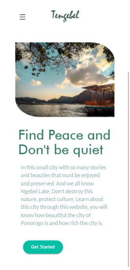

    <h1 align="center">Tengebel</h1>
    

        
    

    
&nbsp;&nbsp;&nbsp;&nbsp;&nbsp;Tengebel merupakan sebuah website yang telah menerapkan teknologi PWA (Progressive Web Apps) serta dalam membangun tampilannya saya menggunakan framework CSS yaitu Materialize CSS.

    
&nbsp;&nbsp;&nbsp;&nbsp;&nbsp;Tengebel ini berisikan tentang Kota kelahiran saya yaitu Kota Ponorogo. Jadi website ini berisikan apa saja yang berkaitan dengan Kota Ponorogo baik, makanan khasnya, cerita-cerita populer dikalangan masyarakat, budayanya dan juga tidak lupa yaitu tempat wisata yang sering dikunjungi wisatawan.

     
     

    ## Link
    <a href="https://tengebel.web.app">tengebel.web.app</a>

    ## Dokumentasi
    Anda dapat melihatnya pada folder doc

    ## Tampilan pada laptop
    

    ## Tampilan pada mobile
    
